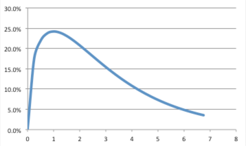

# velmod
The purpose of velmod is to build a Software Development Velocity Model that can be used to evaluate different scheduling strategies. The model takes into account aspects like randomly distributed estimation errors and technical debt, considering that when technical debt is too high, a project freezes to death. Different strategies are evaluated on a dataset sample.

## Background
In 2015 at [Garner](https://www.garnercorp.com/) we were reflecting about deadlines, estimates, velocity, schedule pressure, how it affects code malleability and so on. At the time, Garner was following a 2 weeks iteration agile planning method (we subsequently morphed to a [Kanban](http://kanbanblog.com/explained/) approach, with metrics measured every 2 weeks). We kicked a bunch of ideas around, but we didn’t come up with too many compelling concepts – other than the obvious one that we should treat the developers’ estimates in the planning game itself as gospel, and use the planning game process to inform ourselves of what we will get done in the next two weeks.

To help us understand the scheduling process, we have done some thinking and created the following documents:
* A mathematical model of software development speed, which takes into account technical debt, random variations, and estimating
* A sample hypothetical project, based on a real life system

The intent behind velmod is to take the planned project schedule as input, apply the mathematical model using one of a variety of strategies for dealing with random events during the course of the project, and then tell us how we did compared to the planned schedule, with P10/P50/P90 outputs for the 10th percentile, median, and 90th percentile cases.

## Model
* We – Median estimated work for a given task, man days. This is the original estimate at the start of the project. Now, we obviously want to estimate task work as a range in most cases, but that comes out in the following equations, so we can still work at this stage with the median task estimate.
* Wr – Real work required to do a task without increasing or decreasing technical debt. This is obviously unknown before the task is completed.
  * Note that Wr = We * O * R, where:
    * O - Optimism factor, eg 1.1, if all our estimates are biased optimistic
    * R - Random variation – modelled as a chi-square with P90 value ~4, and P10 value ~0.5
    
* Wa – Actual work done on a task, man days. If this is less than Wr, technical debt increases. If this is greater than Wr, technical debt decreases.
* D0 – Initial technical debt when project starts (this is 0 for a greenfield project)
* D – Current technical debt, man days
* Dx – Technical debt at which development speed drops to zero, man days. Ie, the project is dead
* P – Programmers of effort. Assume for the moment it is just the number of programmers, but bear in mind that we can’t just increase it by adding more guys – the net effort goes down as you add more guys, due to management/co-ordination issues. Hold it fixed for now
* V - Development velocity, in terms of man days of estimated work that is completed per calendar day

Given all this, at project start, define V = P

As project proceeds, V = P (1 – (D – D0) / (Dx – D0))
* At start, when D = D0, V = P
* If D = Dx, then V = 0
* If D becomes less then D0, then V will be greater than P.
* If D becomes greater than D0, then V will be less than P.
This assumes that V declines linearly with technical debt from initial to death level. We could vary this by making it some complicated function, but for simplicity this function displays the right overall behaviour and it's very likely good enough.

Furthermore, consider:
* E – Debt payback efficiency. It will be 1 or less. If 1 man day of technical debt can be incurred, and then later fixed with 1 man day of work, E would be 1. If it would take 2 mandays of fixing to pay back 1 day of debt, then E would be 0.5. In practice, E is probably a function of D which gets smaller as D is larger, but let’s just assume it is a constant for now.
 
For any given task:
* ∆D = Wr – Wa, if Wr is greater than Wa, and
* ∆D = E (Wr - Wa), if Wr is less than Wa
 
The time (in calendar days) to do any given task n is:
* Tn = Wa / V, where V is calculated based on Dn, ie D at the start of task n

Now, since Wa is not calculated based on the other figures, we can have some obvious strategies. They are:

1. Run at constant technical debt: in this case, set Wa = Wr, and then you can solve for Tn. This lets you match a set of estimated tasks to the calendar. Let's call this Strategy 1.
2. Stick to the schedule: define Tn for a set of tasks. Determine Wa for each one based on Tn, and then have the changing level of technical debt take up the slack. Of course, you might hit Dx during the project, in which case the project is dead and has to start over. Let's call this Strategy 2.
3. Stick to the schedule for a while, and then run with constant technical debt: this is a hybrid, where we decide that we stick to the schedule until V drops to a certain fraction, eg 50%, of the original velocity. Then we run at constant technical debt for the rest of the project. Let's call this Strategy 3.
4. Stick to the schedule for a while, and then recover to some extent. This is one where we stick to the schedule until V drops to a certain fraction, eg 50%, of the original velocity. Then we decide to start cleaning up while still developing, and decide that Wa for each task will be Wr for that task times C, where C is the cleanup factor, and has a value greater than 1. This will increase our velocity over time. The “stick to the schedule for a while, and then run at constant technical debt” strategy is just a special case of this strategy, where C=1. Let's call this Strategy 4.

We could also have some variations, like stick to the schedule but, if debt is going to drop below D0, then don’t reduce the debt that much – just get some stuff done ahead of schedule.

All the “stick to the schedule” options can be changed to “Stick to the schedule but allow some slippage” options, where we define Tn_ideal as the ideal schedule, but we accept Tn_actual = Tn_ideal times S, where S is a slippage factor greater than 1. This would allow us to have a semi-flexible schedule, where we predefine it but can let it slip gradually over time if needed to keep technical debt under control.

Note that:
* Dx is a predetermined value related to how big is the project => we are deciding for now to set it to ΣWe * O * 75%, equal for example in the current data sample to 320 * 1.1 * 75% = 264, hence as soon as the technical debt reaches that quota the project is dead
* In strategy 2 (stick to the schedule), we are going to limit the minimum amount of work that needs to be done on something to 25% of Wr => this means that regardless of how the schedule is set, Wa cannot be less than 25% of Wr

Practically speaking, each task takes a time which is from the chi-square - a mean and a distribution. But, the tasks must be done in sequence (for the purpose of the model taking into account real-life parallel implementation doesn't really help, while complicating the model significantly).
So, when scheduling the whole project, there is a completion date for task 1, task 2 (based on task 1 being completed and then task 2 being completed) and so on. 
While the time for each task will be chi-square, the date that a given task is finished won't be, as it depends on the previous tasks. Effectively, this means combining N distributions through their partial sums, but due to impact of technical debt, while randomization in input is independent, task completion dates are not and we cannot combine them via the convolution of the individual distributions. For more information on this topic, see for example http://www.math.uah.edu/stat/sample/CLT.html 

In the end, we want to run the simulation, say, 1000 times, and then getting a completion date distro from that for each task will be the easiest and most flexible to play with later. That way we can easily eventually do things like say "I want a 90% chance of hitting each of the first three milestones, and 25% chance of hitting all the ones after that".

### Q&A
1. Q: Can we define V in terms of man days of work per calendar day that can be used against Wa?  
A: That's exactly what it is. Think of V as the amount of Wa that can be produced in a single calendar day.
2. Q: Re "This assumes that V declines linearly with technical debt from initial to death level" => the reality is different obviously (and you don't discount it).  
In practice a small amount of tech debt is physiological and very very hard to avoid, even in ideal conditions (it's because accidental complexity creeps in in many different ways, even where there is no external pressure, but it floods everything like a tsunami under pressure). Above a certain level, difficult to quantify, it becomes virulent and endemic and it slows everything down more than linearly. Beyond that there's only death and despair. :smile:  
A: In the more general case, we can have V = P (1 - ( ( D - D0 ) / ( Dx - D0 ) )^n ), or even an exponential function

# Setup
Make sure that you have the latest sbt on your system:

    SBT: http://www.scala-sbt.org/download.html

## IDE Setup
* IntelliJ - IntelliJ has built in SBT support so when importing just make sure you import the SBT file directly and it will figure everything else out.
* Eclipse - At the time of this writing, Eclipse does not understand SBT natively so make sure you use the `sbt eclipse` command from the root folder to create the necessary eclipse files.

# Usage
All commands below are run from the root folder of the project.

`sbt test` - Will run all tests for the application

